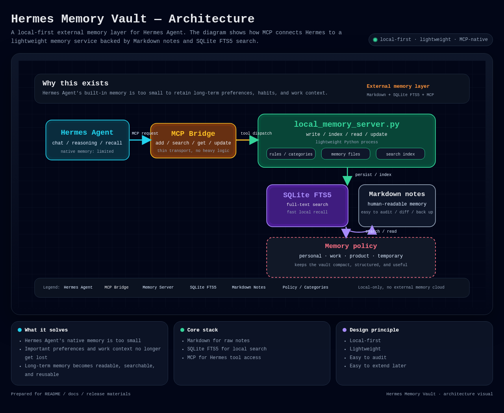

# Hermes Memory Vault

[中文](#中文) | [English](#english)

[](https://github.com/)
[](https://modelcontextprotocol.io/)
[](https://github.com/)
[](LICENSE)

---

## 中文

**Hermes Memory Vault** 是一个面向 **Hermes Agent** 的轻量级本地外置记忆方案。

它通过 **Markdown + SQLite FTS5 + MCP** 的组合，为智能体提供可持续增长、可检索、可维护的长期记忆层。

我们做这个项目，核心原因很直接：**Hermes Agent 自带的记忆容量太有限，很多真正重要的偏好、习惯和工作信息根本存不住。**

这不是一个“概念仓库”，而是一套已经落地、已经跑通、并且适合继续扩展的 **本地记忆基础设施**。

> **一套为 Hermes Agent 打造的本地优先记忆层：部署轻、审计清、扩展顺、真正能用。**

> **我们做它，是因为 Hermes Agent 原生能保存的记忆太少，远远不够承载长期使用所需的信息。**

### Project Highlights
- **Local-first by design** — no external memory cloud required
- **Human-readable notes** — raw memory is stored as Markdown
- **Fast local recall** — SQLite FTS5 enables compact, practical search
- **MCP-native interface** — a simple tool surface for Hermes to read and write memory
- **Template-ready** — easy to fork, adapt, and extend

### 项目定位
- 面向 Hermes Agent 的本地外置记忆层
- 适合轻量宿主机部署
- 以可读、可检索、可维护为核心设计目标
- 提供可直接 fork 和二次开发的模板
- 预留从轻量方案升级到更完整记忆系统的路径

### 设计目标
- **轻量化**：单机可运行，资源占用低
- **可读性**：原始内容以 Markdown 保存，方便人工查看与审计
- **可检索性**：SQLite FTS5 提供本地全文检索
- **可扩展性**：通过 MCP 暴露统一工具接口，便于后续接入更多能力
- **Hermes 友好**：针对 Hermes Agent 的本地运行场景设计

### 为什么这个项目值得关注
- 它把“记忆”从聊天记录里拆出来，变成真正可复用的资产
- 它兼顾了**人能读懂**和**机器能调用**两种需求
- 它不依赖重型基础设施，却保留了后续升级空间
- 它适合做成个人可持续使用的 AI 记忆中枢
- 它直接回应了 Hermes Agent 原生记忆容量不足的问题
- 它不是为了炫技，而是为了让长期记忆真正可用

### 主要特性
- 本地 Markdown 记忆笔记
- SQLite FTS5 全文检索
- MCP 工具接口：新增 / 查询 / 读取 / 更新 / 最近记录
- 低资源占用，适合小内存宿主机
- 主题分类：`personal` / `work` / `product` / `temporary`

### 目录结构
```text
memory-vault/
├─ README.md
├─ LICENSE
├─ CHANGELOG.md
├─ CONTRIBUTING.md
├─ src/
│  └─ local_memory_server.py
├─ config/
│  └─ rules.yaml
├─ examples/
│  └─ hermes-config-snippet.yaml
└─ docs/
   ├─ architecture.md
   └─ usage.md
```

### 架构一览



> 如果你想看可交互的原始版本，也可以直接打开 `docs/assets/hermes-memory-vault-architecture.html`。

### MCP 工具
- `memory_init`
- `memory_add`
- `memory_search`
- `memory_get`
- `memory_update`
- `memory_recent`

### Screenshots / Demo
- `docs/assets/` 可放架构图、流程图或实际运行截图
- 推荐优先补一张：Hermes 调用 `memory_search` 的实际返回示例
- 如果后续加 Web UI，这里可以直接替换成在线预览截图

### Quick Hermes Integration
Add this to `~/.hermes/config.yaml`:

```yaml
mcp_servers:
  local_memory:
    command: python3
    args:
      - /path/to/hermes-memory-vault/src/local_memory_server.py
    timeout: 30
    connect_timeout: 20
```

> Replace `/path/to/hermes-memory-vault/` with the actual local path of the repository.

### What makes it a strong fit for Hermes
- Minimal setup surface, easy to wire into existing Hermes workflows
- Lightweight enough for small hosts, yet structured enough for long-term use
- Clear separation between raw notes, search index, and MCP transport
- A practical memory foundation that can be extended without redesigning everything

### Use Cases
- Persisting long-term preferences and recurring habits
- Saving writing style and work conventions
- Storing product comparison conclusions
- Archiving temporary but valuable conversation outcomes

### Resource Usage
Designed for lightweight hosts:
- No separate database server required
- No vector database required
- Runs with a single Python process

### Upgrade Path
- Add vector search
- Add automatic summarization and compaction
- Add relation graph and richer taxonomy
- Add a web management UI

### Privacy & Security
- Local-first storage by default
- Raw content remains auditable
- No external cloud memory dependency

### License
MIT

### Roadmap
- v0.1.0: Core local memory layer, Markdown + SQLite FTS5 + MCP
- v0.2.0: Better compaction and richer memory classification
- v0.3.0: Optional visualization / web management UI
- v1.0.0: Stable memory foundation for long-term Hermes workflows

### Release
- v0.1.0: Initial public release.

### More Visuals
- Add a rendered architecture diagram in `docs/assets/architecture.png`
- Add a screenshot of Hermes invoking the memory tools
- Add a compact example of search results or note retrieval

---

## English

**Hermes Memory Vault** is a lightweight local external memory solution built for **Hermes Agent**.

It combines **Markdown + SQLite FTS5 + MCP** to provide a persistent, searchable, and maintainable long-term memory layer for agents.

We built this because **Hermes Agent’s native memory is simply too small** to hold the preferences, habits, and work context that matter over time.

This is not a proof-of-concept toy. It is a working local memory infrastructure that is already wired up and ready to be extended.

> **A polished, local-first memory layer for Hermes Agent — fast to deploy, easy to audit, and built to grow.**

> **We built it because Hermes Agent’s built-in memory is too limited to carry the information that long-term use actually needs.**

### Project Highlights
- **Local-first by design** — no external memory cloud required
- **Human-readable notes** — raw memory is stored as Markdown
- **Fast local recall** — SQLite FTS5 enables compact, practical search
- **MCP-native interface** — a simple tool surface for Hermes to read and write memory
- **Template-ready** — easy to fork, adapt, and extend

### Project Positioning
- A local external memory layer for Hermes Agent
- Designed for lightweight host machines
- Built around readability, searchability, and maintainability
- Provides a ready-to-fork template for further development
- Leaves room for future expansion into a richer memory system

### Design Goals
- **Lightweight**: runs locally with minimal resource usage
- **Readable**: raw notes are stored as Markdown for easy inspection and auditing
- **Searchable**: SQLite FTS5 enables local full-text search
- **Extensible**: MCP exposes a unified tool interface for future integrations
- **Hermes-friendly**: tailored for Hermes Agent local deployment scenarios

### Why this project stands out
- It separates memory from chat history and turns it into a reusable asset
- It balances human readability with machine accessibility
- It avoids heavy infrastructure while preserving upgrade headroom
- It is suitable as a durable personal AI memory hub
- It feels lightweight at runtime, but structured enough to scale with the user
- It is practical enough for real deployment, not just a demo

### Key Features
- Local Markdown memory notes
- SQLite FTS5 full-text search
- MCP tools for add / search / read / update / recent notes
- Low resource footprint, suitable for small-memory hosts
- Category-based organization: `personal` / `work` / `product` / `temporary`

### Repository Layout
```text
memory-vault/
├─ README.md
├─ LICENSE
├─ CHANGELOG.md
├─ CONTRIBUTING.md
├─ src/
│  └─ local_memory_server.py
├─ config/
│  └─ rules.yaml
├─ examples/
│  └─ hermes-config-snippet.yaml
└─ docs/
   ├─ architecture.md
   └─ usage.md
```

### MCP Tools
- `memory_init`
- `memory_add`
- `memory_search`
- `memory_get`
- `memory_update`
- `memory_recent`

### Quick Hermes Integration
Add this to `~/.hermes/config.yaml`:

```yaml
mcp_servers:
  local_memory:
    command: python3
    args:
      - /path/to/hermes-memory-vault/src/local_memory_server.py
    timeout: 30
    connect_timeout: 20
```

> Replace `/path/to/hermes-memory-vault/` with the actual local path of the repository.

### What makes it a strong fit for Hermes
- Minimal setup surface, easy to wire into existing Hermes workflows
- Lightweight enough for small hosts, yet structured enough for long-term use
- Clear separation between raw notes, search index, and MCP transport
- A practical memory foundation that can be extended without redesigning everything

### Use Cases
- Persisting long-term preferences and recurring habits
- Saving writing style and work conventions
- Storing product comparison conclusions
- Archiving temporary but valuable conversation outcomes

### Resource Usage
Designed for lightweight hosts:
- No separate database server required
- No vector database required
- Runs with a single Python process

### Upgrade Path
- Add vector search
- Add automatic summarization and compaction
- Add relation graph and richer taxonomy
- Add a web management UI

### Privacy & Security
- Local-first storage by default
- Raw content remains auditable
- No external cloud memory dependency

### License
MIT

### Roadmap
- v0.1.0: Core local memory layer, Markdown + SQLite FTS5 + MCP
- v0.2.0: Better compaction and richer memory classification
- v0.3.0: Optional visualization / web management UI
- v1.0.0: Stable memory foundation for long-term Hermes workflows

### Release
- v0.1.0: Initial public release.
